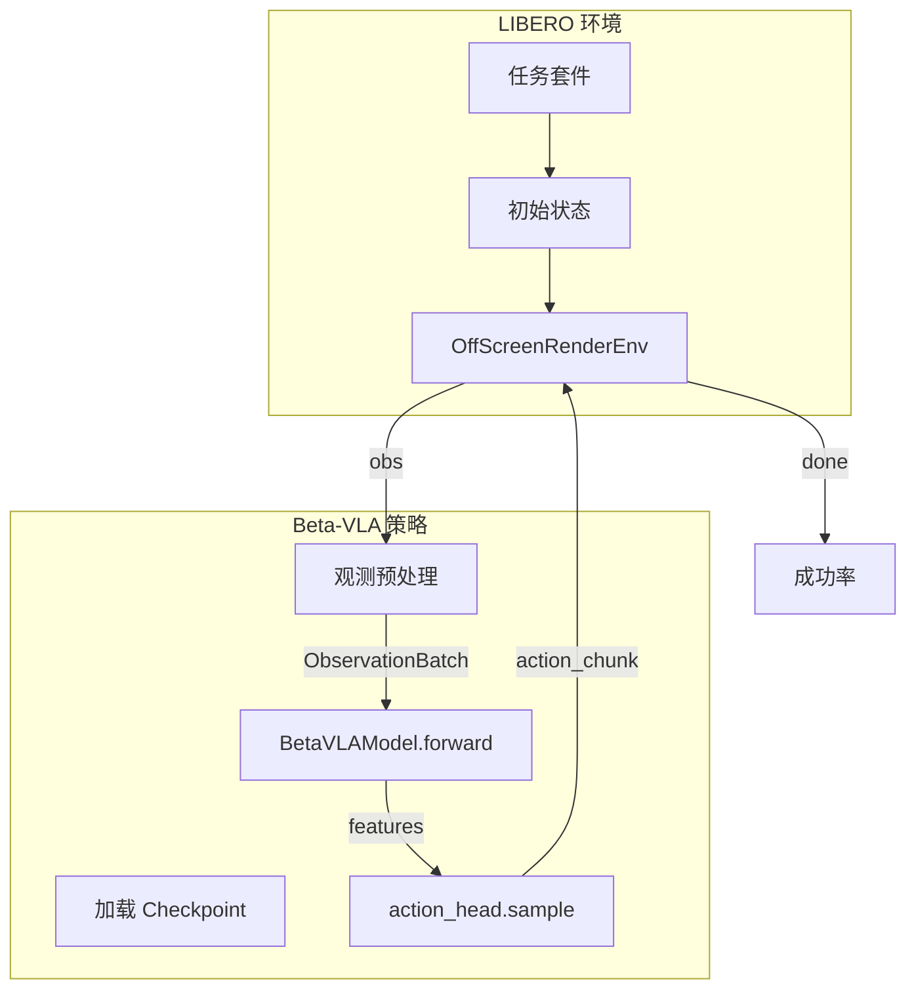

# Beta-VLA LIBERO 评估计划（中文版）

## 一、OpenPI 与 OpenVLA 的 Action 归一化处理

### OpenVLA 的 Action 归一化

**训练阶段：**

- RLDS 数据加载时，对 action 做归一化到 [-1, 1]
- 使用 dataset statistics：`min/max` 或 `q01/q99`（分位数）
- 统计量保存在 `norm_stats` 中，按数据集 key 存储（如 `libero_spatial_no_noops`）
- 训练时保存 `dataset_statistics` 供推理反归一化

**推理阶段：**

1. **反归一化公式**（`_unnormalize_actions`）：
  ```
   action = 0.5 * (normalized + 1) * (action_high - action_low) + action_low
  ```
   其中 `action_high`/`action_low` 来自 `norm_stats[unnorm_key]["action"]` 的 `q99`/`q01` 或 `max`/`min`
2. **Gripper 后处理**（`process_action`）：
  - `normalize_gripper_action`：将 gripper 从 [0,1] 映射到 [-1,+1]，并二值化为 ±1
  - `invert_gripper_action`：翻转 gripper 符号。因为 RLDS 数据中 0=关、1=开，而 LIBERO 环境期望 -1=开、+1=关

**代码位置**：[openvla-oft/experiments/robot/libero/run_libero_eval.py](openvla-oft/experiments/robot/libero/run_libero_eval.py) 第 265-273 行

---

### OpenPI 的 Action 归一化

**训练阶段：**

- 使用 `Normalize` transform，支持 mean/std 或 quantile（q01/q99）
- Quantile 归一化公式：`(x - q01) / (q99 - q01) * 2 - 1` → [-1, 1]
- `norm_stats` 由 `scripts/compute_norm_stats.py` 在数据集上预计算

**推理阶段：**

1. **反归一化**（`Unnormalize`，在 `output_transforms` 中）：
  - Quantile 反归一化：`(x + 1) / 2 * (q99 - q01) + q01` → 还原到原始尺度
  - 模型输出的是归一化后的 action，经 Unnormalize 后得到 env 所需格式
2. **Gripper**：OpenPI 的 LiberoOutputs 只做 `actions[:, :7]` 切片，**没有**显式 gripper invert。因为训练数据（LeRobot 格式）与 env 的 gripper 约定一致，反归一化后即为 env 格式。

**代码位置**：[openpi/src/openpi/transforms.py](openpi/src/openpi/transforms.py) 第 137-180 行；[openpi/src/openpi/policies/policy_config.py](openpi/src/openpi/policies/policy_config.py) 第 81-87 行

---

### Beta-VLA 与两者的对比


| 项目             | OpenVLA                    | OpenPI                 | Beta-VLA                                                                 |
| -------------- | -------------------------- | ---------------------- | ------------------------------------------------------------------------ |
| 训练时 action 归一化 | 有（RLDS pipeline）           | 有（Normalize transform） | **无**（libero_loader 直接用原始 action）                                        |
| 推理时反归一化        | 有（unnorm_key + norm_stats） | 有（Unnormalize）         | **不需要**（模型输出即原始尺度）                                                       |
| Gripper 处理     | normalize + invert         | 无（数据已对齐）               | **待验证**（physical-intelligence/libero 源自 modified_libero_rlds，可能需 invert） |


---

## 二、参考实现对比


| 方面        | OpenPI                                                           | OpenVLA                                                                                                            |
| --------- | ---------------------------------------------------------------- | ------------------------------------------------------------------------------------------------------------------ |
| 评估脚本      | [openpi/examples/libero/main.py](openpi/examples/libero/main.py) | [openvla-oft/experiments/robot/libero/run_libero_eval.py](openvla-oft/experiments/robot/libero/run_libero_eval.py) |
| 策略加载      | Websocket 服务端 + 客户端                                              | 直接加载模型                                                                                                             |
| 任务加载      | `benchmark.get_benchmark_dict()`                                 | 相同                                                                                                                 |
| 成功指标      | `env.step()` 返回的 `done`                                          | 相同                                                                                                                 |
| Replan 步数 | 5                                                                | 8                                                                                                                  |


---

## 三、整体架构




---

## 四、I/O 映射

**观测（env → model）：**

- `agentview_image`（180° 旋转）→ `base_0_rgb`（224×224，float32，[0,1]）
- `robot0_eye_in_hand_image`（180° 旋转）→ `left_wrist_0_rgb`
- `state`：`[robot0_eef_pos, quat2axisangle(robot0_eef_quat), robot0_gripper_qpos]`（8D）→ 截断/填充为 7D
- `prompt`：`task.language`（任务描述）

**动作（model → env）：**

- 模型输出 `(1, action_horizon, 7)`，来自 flow-matching sample
- 取前 `replan_steps` 个 action（建议 5）
- 逐个执行 `env.step(action.tolist())`
- **Gripper**：physical-intelligence/libero 源自 modified_libero_rlds，若为 RLDS 约定（0=关、1=开），需在 env.step 前做 `invert_gripper_action`。建议加 `--invert_gripper` 开关做对比验证。

---

## 五、实现步骤

### 1. 评估脚本 `scripts/eval_libero.py`

- **参数**：`--checkpoint`、`--task_suite_name`、`--num_trials_per_task`、`--replan_steps`、`--num_steps_wait`、`--seed`、`--video_out_path`、`--log_dir`、`--invert_gripper`
- **任务套件**：libero_spatial、libero_object、libero_goal、libero_10、libero_90
- **最大步数**：与 OpenPI 一致（220、280、300、520、400）

### 2. 推理工具 `src/betavla/eval/`

- **inference.py**：加载 checkpoint、构建 ObservationBatch、预测 action
- **libero_utils.py**：环境创建、图像提取（含 180° 旋转）、`quat2axisangle`、`process_action_for_env`（含可选的 gripper invert）

### 3. Checkpoint 加载

- 路径：`checkpoints/beta_vla_libero/{step}/model.safetensors` 或 `best/`
- 使用 `safetensors.torch.load_model` 加载
- 配置与 `configs/train_beta_vla_libero.yaml` 一致（action_dim=7、action_horizon=10）

### 4. 依赖与安装

- LIBERO：`libero` 或 `third_party/libero` 子模块
- 可选：`imageio` 保存 rollout 视频

**bddl 构建失败（NFS 环境）**：若 pip 安装 `bddl` 时出现 `[Errno 39] Directory not empty: 'freeze_fruit'`，是因为 NFS 上删除目录会留下 `.nfs*` 隐藏文件。解决：将 `TMPDIR` 和 pip 缓存指向**本地磁盘**（如 `/tmp`）再安装：

```bash
# 使用本地磁盘避免 NFS 导致的 bddl 构建失败
export TMPDIR=/tmp
export PIP_CACHE_DIR=/tmp/pip_cache
pip install robosuite==1.4.1 bddl easydict cloudpickle gym imageio[ffmpeg]
```

### 5. 评估循环伪代码

```python
for task_id in range(num_tasks):
    task = task_suite.get_task(task_id)
    initial_states = task_suite.get_task_init_states(task_id)
    env, task_description = get_libero_env(task, 256)
    for episode in range(num_trials_per_task):
        env.reset()
        obs = env.set_init_state(initial_states[episode])
        action_queue = deque()
        for t in range(max_steps + num_steps_wait):
            if t < num_steps_wait:
                obs, _, _, _ = env.step(LIBERO_DUMMY_ACTION)
                continue
            if not action_queue:
                obs_batch = prepare_observation(obs, tokenizer)
                actions = model(obs_batch)["actions"][0].cpu().numpy()
                action_queue.extend(actions[:replan_steps])
            action = process_action_for_env(action_queue.popleft(), invert_gripper=args.invert_gripper)
            obs, reward, done, info = env.step(action.tolist())
            if done: success += 1; break
```

---

## 六、文件清单


| 文件                                 | 用途               |
| ---------------------------------- | ---------------- |
| `scripts/eval_libero.py`           | CLI 入口，组织评估循环    |
| `src/betavla/eval/__init__.py`     | 包初始化             |
| `src/betavla/eval/inference.py`    | 加载模型、准备观测、预测     |
| `src/betavla/eval/libero_utils.py` | 环境、图像、action 后处理 |


---

## 七、训练流程对齐（与 OpenPI/OpenVLA 保持一致）

### 1. Action 归一化（对齐 OpenPI）

**目标**：训练时对 action（及 state）做 quantile 归一化，与 OpenPI 一致。

**实现步骤**：

1. **新增 `scripts/compute_norm_stats.py**`（参考 [openpi/scripts/compute_norm_stats.py](openpi/scripts/compute_norm_stats.py)）
  - 遍历 physical-intelligence/libero 数据集
  - 对 `state`、`actions` 计算 RunningStats（mean、std、q01、q99）
  - 保存到 `assets/physical-intelligence/libero/norm_stats.json`
2. **修改 `libero_loader.py**`
  - 加载 norm_stats
  - 在 collate 前对 state、actions 做 quantile 归一化：`(x - q01) / (q99 - q01 + 1e-6) * 2 - 1` → [-1, 1]
  - 将 norm_stats 保存到 checkpoint 目录，供推理反归一化
3. **修改 `action_head.compute_loss**`
  - 输入 actions 已为归一化后的值，无需改 loss 计算
4. **推理时**
  - 加载 norm_stats，对模型输出做反归一化：`(x + 1) / 2 * (q99 - q01) + q01`

### 2. 训练流程差异检查清单


| 项目               | OpenPI                                     | OpenVLA                   | Beta-VLA 当前         | 建议                   |
| ---------------- | ------------------------------------------ | ------------------------- | ------------------- | -------------------- |
| **Action 归一化**   | Quantile (q01/q99)                         | Bounds (q01/q99)          | 无                   | 对齐 OpenPI，加 quantile |
| **State 归一化**    | 有（同 action）                                | 有（proprio）                | 无                   | 加 state 归一化          |
| **图像格式**         | uint8 HWC，resize_with_pad                  | TF resize + center_crop   | float32，interpolate | 确认训练数据格式；eval 时与训练一致 |
| **图像旋转**         | 无（数据已处理）                                   | 180°（eval 时）              | 无                   | 若训练数据未旋转，eval 需 180° |
| **State 维度**     | 8D（eef_pos 3 + quat2axisangle 3 + gripper） | 8D                        | 7D（pad/truncate）    | 统一为 8D 或 7D，与数据集一致   |
| **Prompt 格式**    | 原始 task.language                           | "In: What action... Out:" | 原始 prompt           | 保持原始 prompt          |
| **Action chunk** | 10，replan 5                                | 8，replan 8                | 10，replan 待定        | replan 5（对齐 OpenPI）  |


### 3. 需确认的细节

- **State 维度**：physical-intelligence/libero 的 state 为 8D，beta-vla 用 7D。若加 state 归一化，norm_stats 的 state 为 8D，模型输入需 pad 到 8 或截断到 7。
- **图像**：HF 数据集图像可能是 float [0,1] 或 uint8。vision_tower 的 `_preprocess` 已处理 `min<0` 时 `(x+1)/2`，需与数据格式一致。

---

## 八、评估参考：OpenPI 还是 OpenVLA？

**建议：以 OpenVLA 为主，OpenPI 为辅。**


| 维度             | OpenVLA                           | OpenPI                                   | 推荐                      |
| -------------- | --------------------------------- | ---------------------------------------- | ----------------------- |
| **架构相似度**      | VLA + action head，直接加载 checkpoint | Pi0 架构不同，Websocket 部署                    | OpenVLA（与 beta-vla 更接近） |
| **数据源**        | modified_libero_rlds              | LeRobot 转换的 physical-intelligence/libero | beta-vla 用后者，但格式同源      |
| **实现复杂度**      | 单脚本，直接 load 模型                    | 需起 policy server + client                | OpenVLA 更简单             |
| **Action 后处理** | 反归一化 + gripper invert 明确          | 依赖 norm_stats，无显式 invert                 | 两者都需反归一化；gripper 需验证    |
| **可复现性**       | 有完整 run_libero_eval.py            | 有 main.py + compose                      | OpenVLA 更易本地复现          |


**具体建议**：

- **评估脚本结构**：参考 OpenVLA 的 `run_libero_eval.py`（单文件、draccus 配置、直接 load 模型）
- **任务循环、max_steps、initial_states**：与 OpenPI 保持一致（同一 benchmark 定义）
- **Action 后处理**：采用 OpenPI 的 quantile 反归一化；gripper 加 `--invert_gripper` 开关做对比
- **Replan 步数**：先用 5（OpenPI），与 action_horizon=10 匹配

---

## 九、待确认问题

1. **Gripper**：加 `--invert_gripper`，在少量 trial 上对比 True/False。
2. **Checkpoint**：支持 `best/` 或指定 step（如 6000）。
3. **部署方式**：优先 standalone 脚本（类似 OpenVLA）。
4. **State 维度**：统一用 7D 还是 8D？physical-intelligence/libero 为 8D。

